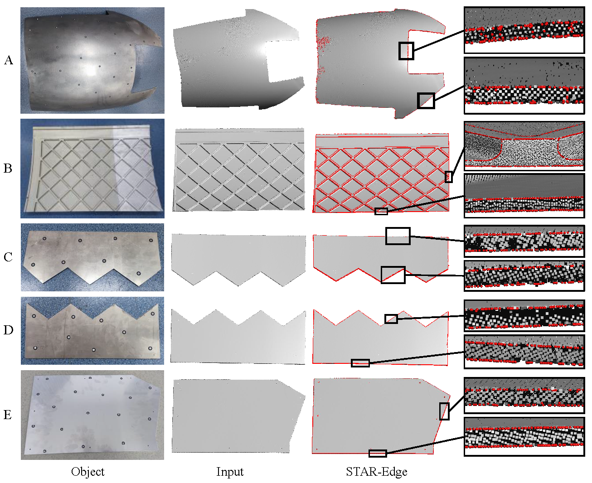

# STAR-Edge

In this work, we presented **STAR-Edge**, a novel point cloud edge extraction approach specifically designed for thin-walled structures. The core of our method is the introduction of a new structure-aware neighborhood representation—the local spherical curve. This representation effectively emphasizes co-planar points while minimizing interference from unrelated surfaces, enabling robust and accurate edge detection in complex thin-walled geometries.


## Preparation

### Installation Prerequisites

- Python 3.8
- CUDA 11.8
- PyTorch 2.1.2
- tqdm, natsort

```
pip install tqdm
pip install natsort
```

- fftw

```
wget http://www.fftw.org/fftw-3.3.9.tar.gz
tar -xvf fftw-3.3.9.tar.gz
cd fftw-3.3.9
mkdir build
cd build
cmake ..
make install
```
You may need to add the library path
```
export LD_LIBRARY_PATH=/usr/local/lib:$LD_LIBRARY_PATH
```
- LocalSH

```bash
cd LocalSH
mkdir build
cd build
cmake ..
make install
```

## Demo

```
python eval_all.py
```

### Data Preparation

- The data is expected to be in the following file structure:

  ```
  |-- dataset/
      |-- thin_walled/
          |-- gt
          |-- pc
  |-- dataset_pre/
      |-- pre_data_thin/
          |-- cls_gt
          |-- desc
          |-- pc_normal
  
  ```


## Usage

#### Train

```
python train_thin.py
```

#### Test

```
python eval_thin.py
```

## Visualization Results

**Visual comparison on the thin-walled structure dataset.**


**Visual comparison on 3D shapes from the ABC dataset.**


**Visualization on real thin-walled structure data.**



## Citation


## Acknowledgements

Our code is inspired by fftw.